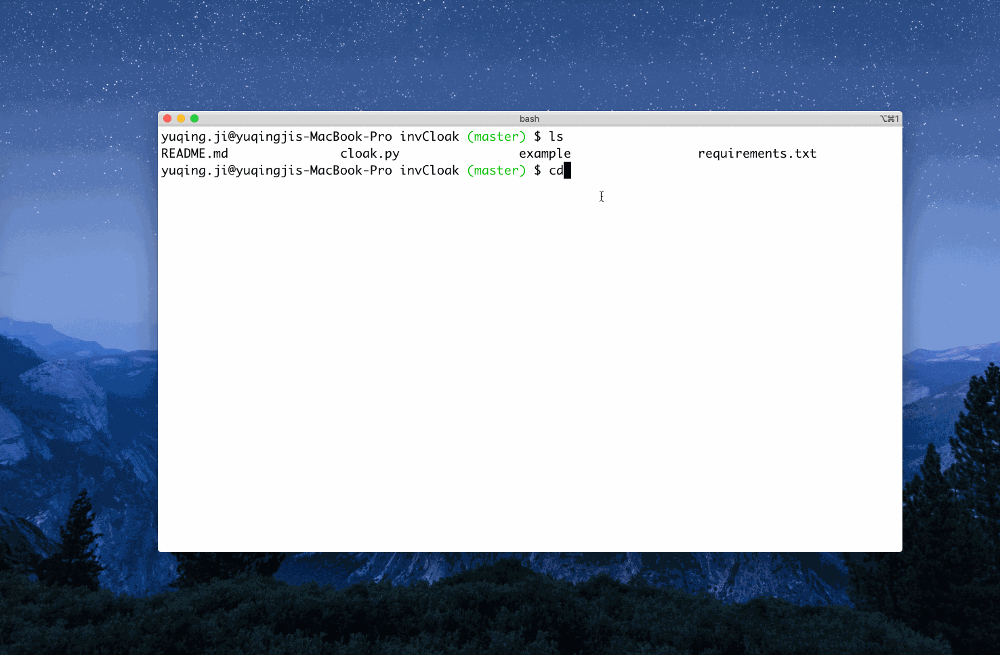

Could you find the difference between the following images?

|L|R|
|||

If you can't, read on. 

I try to draw something in my spare time. After posting 50+ pieces on social media (my Instagram: [gniquyij](https://www.instagram.com/gniquyij/)), a question came to mind:
- How could I protect my work from piracy?

You might notice I've already added a signature in each drawing. But it:
- might block the view
- is easy to be removed
- ...

Is there any other way?

Inspired by other 'blind watermarks', I wrote [invCloak](https://github.com/vjyq/invCloak). 

What I want invCloak to do is to add my watermark to the frequency domain of my drawings so I don't need to rack my brain for it any more. It seems to work. 

Only one step to implement a watermark if you've got environment set up:

```
$ python cloak.py add -r <path-to-the-raw-image> -c <path-to-the-watermark> -d <path-to-the-output>
```

Check out [README](https://github.com/vjyq/invCloak) for more details. 

Back to the beginning of this article. As you've probably guessed, I added a signature to one of the images, which could be extracted with an invCloak command as below:



Note: 
- image L is 'raw.png'
- image R is 'dressed.png'.

Related materials could be found in the [repo](https://github.com/vjyq/invCloak) (folder 'example'). You could have a trial with them. 

Still a lot TODO - anti PS, more hidden, etc. Will keep posted. 

<div><a href="https://vjyq.github.io/daily"></a></div><div style="border-top:1px solid #e1e4e8;padding-top:16px"></div>
<div>© 2018-2020 by YUQING JI</div>
<div style="padding-top:0.3em"><a href="https://vjyq.github.io/en/about">About</a> | <a href="https://vjyq.github.io/">Blog</a> | <a href="mailto:yuqing.ji@outlook.com">Email</a> | <a href="https://github.com/vjyq">Github</a> | <a href="https://vjyq.github.io/zh">中文</a></div>